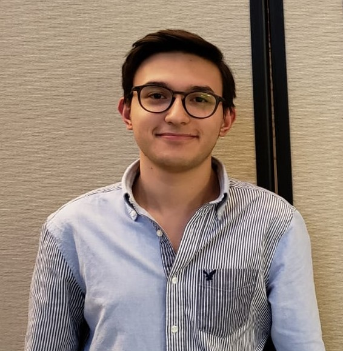
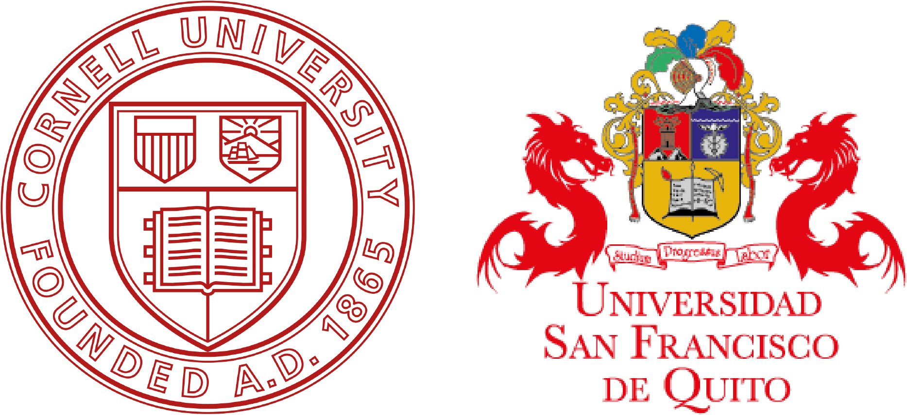

```{r, echo=FALSE, out.width = "150px"}
 
``` 

<br>

**Juan Pablo Jordán**
      
2021 - Present PhD Student
<br> 
Department of Ecology and Evolutionary Biology, Cornell University
<br>
Advisor: Dr. André Kessler

<br>

2017 - 2021 B.S. Biology (Cum Laude & Honors Thesis)
<br>
*Concentration in Biodiversity and Conservation
Universidad San Francisco de Quito (USFQ) 
<br>
Advisor: Dr. Diego F. Cisneros-Heredia  
<br>
<br>
*Full Curriculum Vitae [Click Here](https://github.com/jpj73/jpj73.github.io)
<br>
<br>

```{r, echo=FALSE, out.width= "300px", fig.align='center', dpi=72}
 
``` 

<br>
<br>
<br>

***

<center> _This website was written in R and R Markdown. The source code is available in a [public repository](https://github.com/jpj73/personal_website)._ </center>