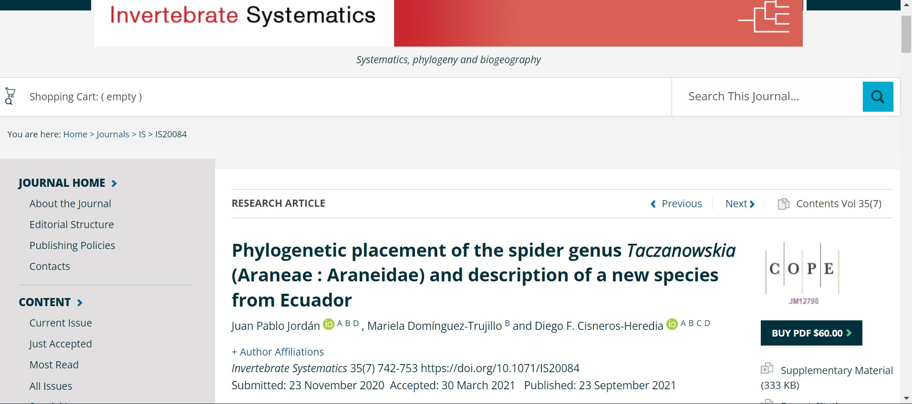
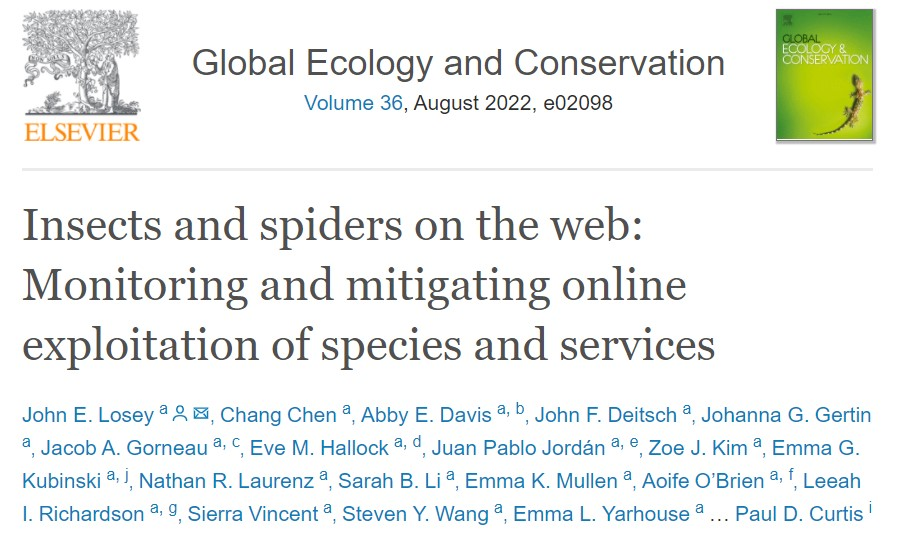

**Accepted**
<br>
**Jordán, J. P**., Domínguez-Trujillo, M., & Cisneros-Heredia, D. F. (2021). Phylogenetic placement of the spider genus Taczanowskia (Araneae: Araneidae) and description of a new species from Ecuador. Invertebrate Systematics, 35(7), 742–753. https://doi.org/10.1071/IS20084 [Click Here](https://www.publish.csiro.au/IS/IS20084) 

initaciáíó

<br>
```{r, echo=FALSE, out.width= "600px", fig.align='center', dpi=72}
 
``` 
<br>

Losey, J. E., Chen, C., Davis, A. E., Deitsch, J. F., Gertin, J. G., Gorneau, J. A., Hallock, E. M.,**Jordán, J. P.**, Kim, Z. J., Kubinski, E. G., Laurenz, N. R., Li, S. B., Mullen, E. K., O’Brien, A., Richardson, L. I., Vincent, S., Wang, S. Y., Yarhouse, E. L., Schydlowsky, A., & Curtis, P. D. (2022). Insects and spiders on the web: Monitoring and mitigating online exploitation of species and services. Global Ecology and Conservation, 36, e02098. https://doi.org/10.1016/j.gecco.2022.e02098 [Click Here](https://www-sciencedirect-com.proxy.library.cornell.edu/science/article/pii/S2351989422001007?via%3Dihub)


```{r, echo=FALSE, out.width= "600px", fig.align='center', dpi=72}
 
``` 
<br>
**In-prep / submitted**


<br>
<br>
<br>

***

<center> _This website was written in R and R Markdown. The source code is available in a [public repository](https://github.com/jpj73/personal_website)._ </center>