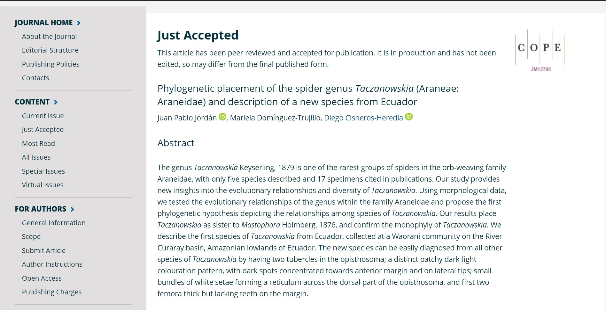

**Accepted**
<br>
_**Jordán, J.P.**, Dominguez-Trujillo, M., Cisneros-Heredia D. F. Phylogenetic revision of the spider genus Taczanowskia: description of a new species from the Amazonian lowlands of Ecuador. In press Invertebrate Systematics._ [Click Here](https://www.publish.csiro.au/IS/justaccepted/IS20084)

<br>
```{r, echo=FALSE, out.width= "600px", fig.align='center', dpi=72}
 
``` 

<br>
**In-prep / submitted**

_Losey, J., Chen, C., Davis, A., Deitsch, J., Gertin, J., Gorneau, J.A., Hallock, E.M., **Jordán, J.P.**, Kim, Z., Kubinski, E., Laurenz, N., Li, S., Mullen, E., O’Brien, A., Richardson, L., Vincent, S., Wang, S., Yarhouse, E., Schydlowsky, A., Curtis, P. Insects and spiders on the web: Monitoring and mitigating online exploitation of invertebrate species and services. In peer review GECCO._

<br>
<br>
<br>

***

<center> _This website was written in R and R Markdown. The source code is available in a [public repository](https://github.com/jpj73/personal_website)._ </center>