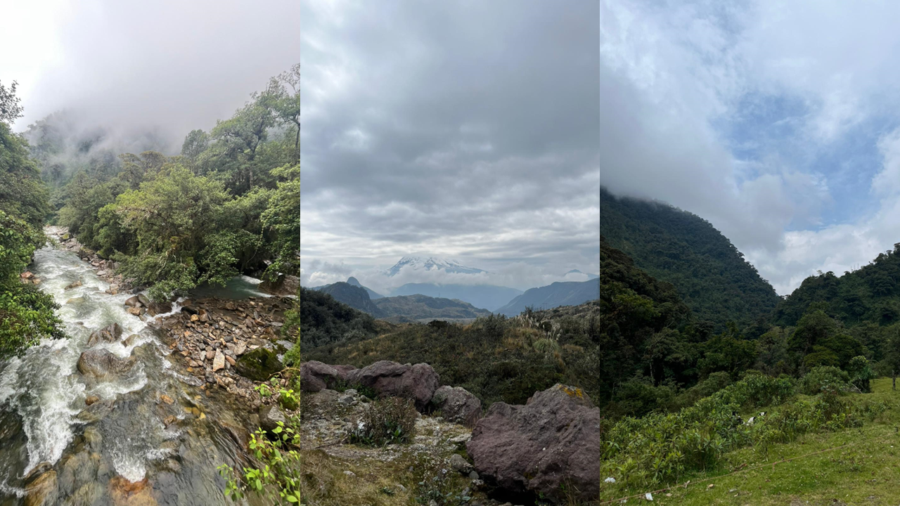

<br>

**Current Research**
<br>  
Winterbreak 2022 field work reflections: 
<br>  
Completing a biology degree in a tropical country is synonym for spending at least a couple of weeks every semester doing field work. From high montane Páramos to lowland Amazonian rainforests, a tropical biologist has a range of ecosystem at their disposal which are ripe and fascinating to study. My return home to Ecuador over winter break came with great excitement to start a project researching hypothesis of phytochemical diversity along elevational gradients. This came with a new challenge: unlike my previous experiences doing fieldwork in Ecuador, this time around I was in charge of overseeing and executing the entire project. Thankfully I was not alone in this task since I had support from my undergraduate mentor and his lab at USFQ. It was great to reconnect with previous colleagues and scientist that inspired me so much when I was just getting my feet wet at doing research. The network of kind, talented, and brilliant people that are part of the academic community must be one of the perks of doing research. I was also very excited of building and leading a research team composed of two very enthusiastic undergraduate students. Training the upcoming generation of Ecuadorian scientist is something I feel very passionate about; young professionals that are without a doubt desperately needed in the Ecuador and worldwide.  
<br> 
After spending almost two years in the US I had almost forgotten the breathtaking scenery that Ecuador packs within its small footprint. While establishing field sites in the eastern slopes of the Andes, a quote by Alexander von Humboldt I read several years ago kept popping up in my head: “Ecuadorians are strange and unique beings: they sleep peacefully surrounded by roaring volcanoes, they live poor among incomparable riches and become happy listening to sad music”. This quote can’t be more accurate. The ever-expansive carpet of greenery growing on top of each other that cover huge valleys defined by crystal-clear white-water rivers is truly a site to behold. One can only pose the question: how is it possible that there is such intense concentration of life in one place? 
<br>  
Unfortunately, no bliss can last. Human disturbance is hard to miss, and what I remembered to be previously pristine forest has either been turned into dull pasture for cattle, furiously logged, or developed into housing projects. Some remnants of forest can be found sparsely distributed which serve as reservoirs of the region’s great biodiversity. Humanity is losing its natural richness at a truly incalculable pace with incalculable consequences. This somber reality is hard to digest for all of us who dedicate our lives to the study nature and its wonderful complexity.
<br>  
Nevertheless, spending time in the Ecuadorian countryside is the best therapy for the mind, soul, and body. The most genuine and generous people are those who roam those evergreen hillsides, people capable of taking from their own deprived food plates to give you a small bite to fuel your field work. People who will kindly invite you into their homes with a smile and guide you around the seemingly impenetrable and hospitable forests. People who live in fragile harmony with the surrounding natural richness and are capable of naming all the plant species without skipping a beat. 
<br>  
This brief but intense field season has been motivated by scientific inquiry but defined by personal growth and deep reflection. I look forward to returning in the summer to complete the project. 
<br>

```{r, echo=FALSE, out.width= "600px", fig.align='center', dpi=300}

 

```
Papallacta - Archidona, Ecuador (Photos by Juan Pablo Jordán). 

***

Reflexiones de trabajar en el campo: 
<br>  
Estudiar biología en un país tropical es sinónimo de pasar al menos un par de semanas al semestre realizando trabajo de campo. Desde los Parámos de alta montaña hasta las llanuras de bosque Amazónico, un biólogo radicado en el trópico tiene a disposición un rango muy amplio de fascinantes ecosistemas para estudiar. Mi retorno a Ecuador estuvo marcado por una gran anticipación de empezar un nuevo proyecto investigando la diversidad fitoquímica en gradientes altitudinales. Este proyecto trajo consigo un nuevo desafío: a diferencia de mis experiencias previas realizando trabajo de campo en Ecuador, en esta ocasión, estaba a cargo de coordinar y ejecutar el proyecto de investigación completo.  Para mi suerte, contaba con el apoyo de mi mentor de pregrado y de su laboratorio, por lo que no estaba solo para ejecutar el proyecto. Fue muy gratificante volver a contactarme con antiguos colegas y científicos que me inspiraron tanto durante esos años en lo que me estaba iniciando en el mundo de la investigación. La red de personas brillantes, talentosas, y cariñosas que son parte de la comunidad académica son sin duda una de las grandes ventajas de hacer investigación. De igual manera, estaba muy emocionado de construir un equipo de trabajo e investigación compuesto por dos estudiantes de pre-grado de la USFQ. Aportar a la formación de la nueva generación de científicos Ecuatorianos es algo que me apasiona mucho; jóvenes profesionales que sin duda el país y en el mundo necesitan de forma desesperada. 
<br>  
Después de pasar casi dos años en los Estados Unidos, casi había olvidado el paisaje sobrecogedor que se encuentra dentro del pequeño territorio Ecuatoriano. Mientras establecía sitios de campo en la vertiente oriental de los Andes, una cita de Alexander von Humboldt que leí hace varios años no dejaba de aparecerse en mi cabeza: “Los Ecuatorianos son seres extraños y únicos: duermen en paz rodeados de volcanes rugientes, viven pobres entre incomparables riquezas y se alegran escuchando música triste”. Esta cita no puede ser más verdadera. La expansiva alfombra de vegetación siempreverde que crece una encima de la otra y cubre enormes valles definidos por ríos de aguas blancas y cristalinas es verdaderamente un paisaje extraordinario. Solo se puede plantear la siguiente pregunta: ¿cómo es posible que exista una concentración tan intensa de vida en un solo lugar?
<br>  
Desafortunadamente, ninguna no todo lo bueno dura para siempre. Es difícil pasar por alto la intervención humana, y lo que recordaba antes como un bosque prístino se ha convertido en pastos importunos para el ganado, ha sido talado furiosamente, o desarrollado en proyectos de vivienda. Todavía se pueden encontrar algunos escasos remanentes de bosque que sirven como reservorios de la gran biodiversidad que una vez abundaba en la región. La humanidad está perdiendo su riqueza natural a un ritmo verdaderamente incalculable con consecuencias también incalculables. Esta sombría realidad es difícil de digerir para todos los que dedicamos nuestra vida al estudio de la naturaleza y su maravillosa complejidad.
<br>  
Sin embargo, pasar un tiempo en el campo es la mejor terapia para la mente, el alma y el cuerpo. Las personas más genuinas y generosas son las que deambulan por esas laderas siempre verdes, personas capaces de sacar de sus propios platos escasos de comida para darte un pequeño bocado para animar tu trabajo de campo. Personas que amablemente te invitan a pasar a sus humildes hogares con una sonrisa y que se ofrecen a guiar por los bosques aparentemente impenetrables. Personas que viven en frágil armonía con la riqueza natural que les rodea y son capaces de nombrar todas las especies de plantas sin la menor duda.
<br>  
Esta breve pero intensa temporada de campo ha estado motivada por la investigación científica pero definida por el crecimiento personal acompañado por una profunda reflexión. Espero volver en el verano para completar el proyecto.

<br>
<br>

**Articles and Press releases**
<br>
*CALS Press Release*: [Rare, endangered insects illegally for sale online](https://cals.cornell.edu/news/2022/04/rare-endangered-insects-illegally-sale-online)

*Forbes Magazine*: [This Ecuadorian Cured His Arachnophobia... And Became A Spider Scientist](https://www.forbes.com/sites/andrewwight/2021/01/03/this-ecuadorian-cured-his--arachnophobia-and-became-a-spider-scientist/?sh=1a84e06f77d2).

<br>
*The Cornell Daily Sun*: [Undergraduate Research Shines at CURB Fall Forum](https://cornellsun.com/2019/11/25/undergraduate-research-shines-at-curb-fall-forum/)

<br>
<br>
<br>

***

<center> _This website was written in R and R Markdown. The source code is available in a [public repository](https://github.com/jpj73/personal_website)._ </center>