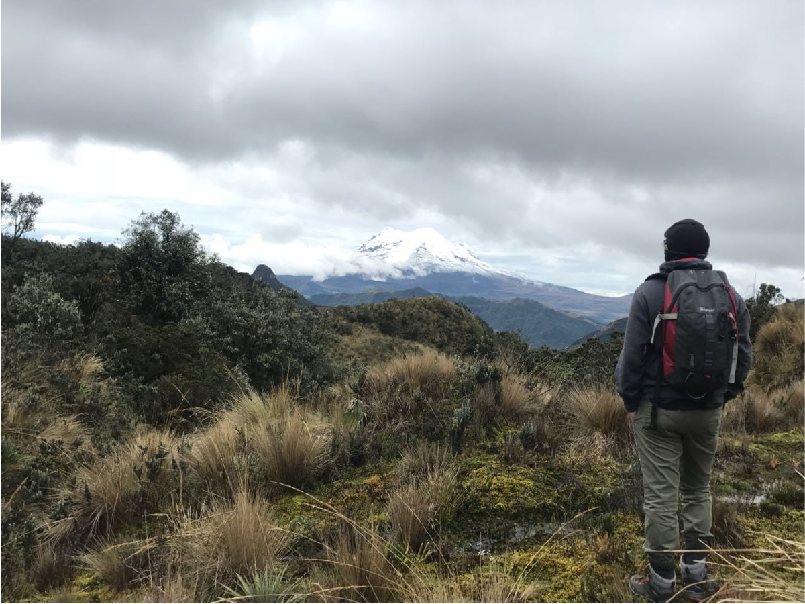

```{r, include=FALSE}
library(knitr)
```

<br>

Hi! My name is Juan Pablo Jordán and I'm currently a first year PhD Student in the Kessler Lab at Cornell University. I am broadly interested in chemical ecology, plant-insect interactions, and novel agricultural systems. 

<br>

```{r, echo=FALSE, out.width= "600px", fig.align='center', dpi=72}

  
```

<br>

Find out about more about me and my research!

*Constant upgrades on form, style, and content will be made to the website. Stay tuned!

<br>
<br>
<br>

***

<center> _This website was written in R and R Markdown. The source code is available in a [public repository](https://github.com/jpj73/jpj73.github.io)._ </center>